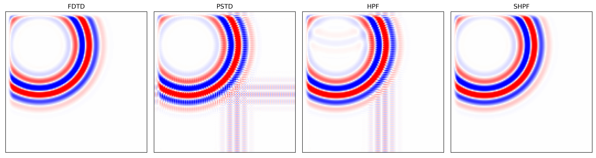
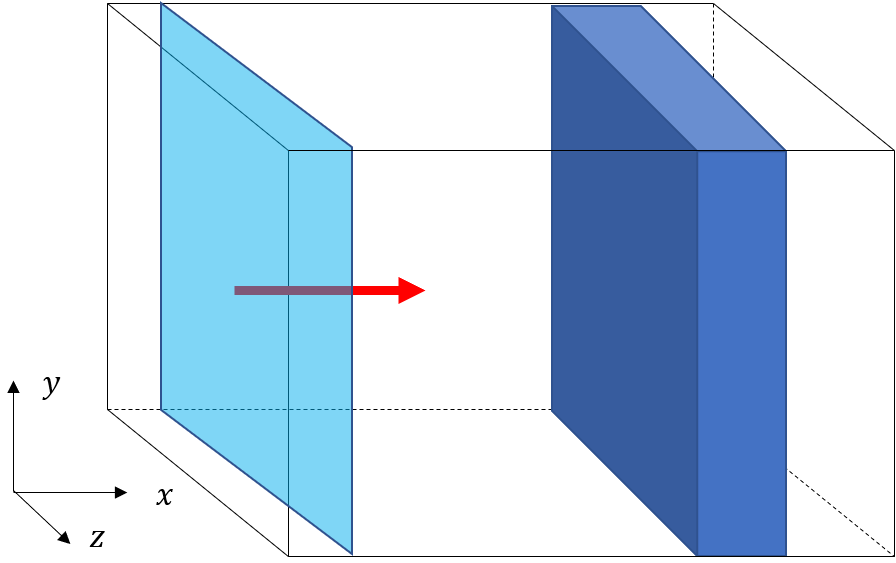
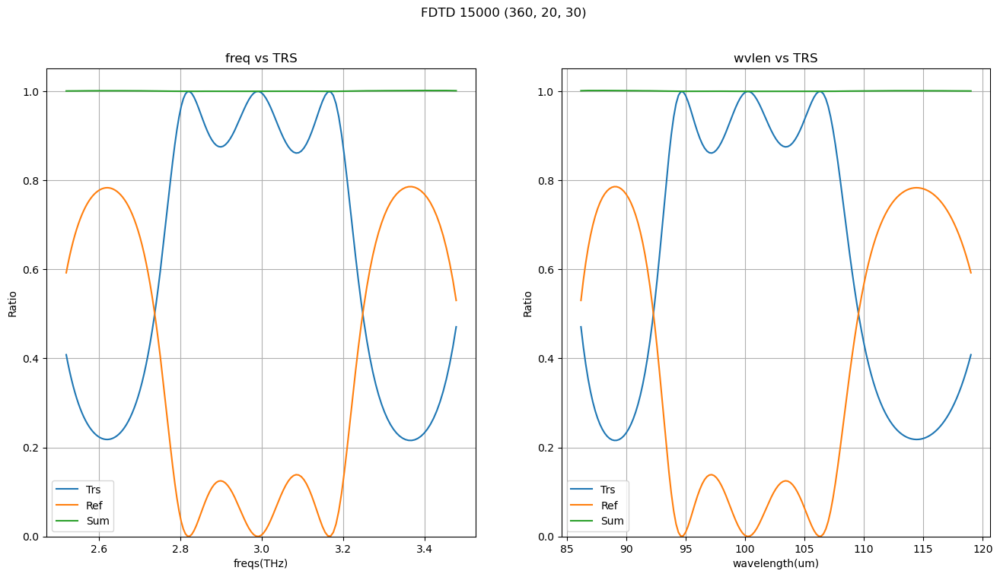

Table of Contents
=================
* [Introduction](#Introduction)
   * Author
   * Citation
   * Features
   * Requirments
* [Usage](#Usage)
   * Basic Command
   * Parallel Computing
   * Examples
* [Installation Guide](#Installation-Guide)
---

# Introduction
<p align="left">
<!--[](https://github.com/steve1029/SHPF/actions/workflows/blank.yml)-->
<a href="https://github.com/steve1029/SHPF/actions/workflows/blank.yml">
   
</a>

<!--[](https://github.com/steve1029/SHPF/LICENSE.md)-->
<!---->
</p>

This package provides the time-domain numerical solvers of Maxwell's equations.
It provides three simulation methods: 

* the Finite-Difference Time-Domain (FDTD) method, 
* the Pseudo-Spectral Time-Domain (PSTD) method 
* the Staggered-grid Hybrid PSTD-FDTD (SHPF) method.

A user can choose to run the program with CPU or GPU, if one has a GPU manufactured by Nvidia.
It also provides two parallel computing methodology, the distributed memory parallelism and shared memory parallelism.
To run this package with full capability, one should use Linux-based COW (cluster of the workstation) that each node has an Nvidia GPU.

## Author
Doctorate in Physics, in Feb 2022, received from the Department of Physics, Korea University.
Currently working at LG innotek.

[**Google Scholar**](https://scholar.google.com/citations?user=iYm5ThEAAAAJ&hl=ko)
[**Curriculum Vitae**](/CV.pdf)

## Citation
If you ues SHPF in your work, please cite the [**Paper**](https://doi.org/10.1016/j.cpc.2020.107631)

Lee, D., Kim, T., & Park, Q. H. (2021). Performance analysis of parallelized PSTD-FDTD method for large-scale electromagnetic simulation. Computer Physics Communications, 259, 107631.

```
@article{Lee2021,
doi = {10.1016/j.cpc.2020.107631},
issn = {00104655},
journal = {Computer Physics Communications},
keywords = {FDTD,Hybrid,PSTD,Parallelization,Roofline model},
month = {feb},
pages = {107631},
publisher = {Elsevier B.V.},
title = {{Performance analysis of parallelized PSTD-FDTD method for large-scale electromagnetic simulation}},
url = {https://doi.org/10.1016/j.cpc.2020.107631 https://linkinghub.elsevier.com/retrieve/pii/S0010465520303039},
volume = {259},
year = {2021}
}
```

## Features
#### Numerical solvers
- **FDTD**: Uses Finite-Difference method to approximate the derivatives in Maxwell's equations.
- **PSTD**: Uses pseudo-spectral methods to approximate the spatial derivatives in Maxwell's equations.
- **SPSTD**: An acronym of Staggered-grid PSTD method. It is a deviation of the PSTD method which uses the Yee grid. (In developing)
- **HPF**: A hybrid PSTD-FDTD method which uses $x$-staggered grid. (Upgraded to SHPF.)
- **SHPF**: Combination of the PSTD and FDTD method. Staggered grid Hybrid PSTD-FDTD(SHPF) method is optimized for large-scale electromagnetic simulations with parallel computing. 

#### Parallelism
* **SMP**: Shared Memory Parallelism (SMP) using OpenMP is provided.
* **MPI**: Message Passing Interface (MPI) parallel programming with OpenMPI(wrapped with mpi4py) is provided.

#### Computing Devices
* **CPU**: If a user wants to run with CPU, choose core engine as 'numpy'.
* **GPU**: If a user wants to run with GPU, choose core engine as 'cupy'.

#### Materials
* So far, only dielectric materials can be modeled.

#### Boundary Conditions
* PBC: Periodic Boundary Conditions.
* BBC: Bloch Boundary Conditions.
* PML: Convolutional PML (CPML) is implemented.

#### Sources
* Dipole source
* Plain wave source
* Gaussian source

#### Numerical statiblity

* The numerical stability of the SHPF method is guaranteed by the staggered grid.
As revealed in [**Cerrea et.al.**](https://doi.org/10.1190/1.1512801) and [**Ozdenvar et.al.**](https://doi.org/10.1111/j.1365-246X.1996.tb04705.x),
the staggered grid shows better stability when solving odd-order derivatives, like first-order derivatives in Maxwell's equations.
Thus, instead of usinsg x-staggered grid of the HPF method, we upgraded for it to use staggered-grid in all directions, and named it the SHPF method.

## Requirements
* Debian/Ubuntu
* COW (not necessary but highly recommanded.)
* SSH Login without password
* OpenMPI (not necessary but required when computing with multiple nodes.)
* OpenMP
* Nvidia driver
* CUDA toolkits
* Python3
* Python3 libraries
    * Matplotlib
    * Scipy
    * Numpy
    * Cupy
    * h5py: $\varepsilon$ and $\mu$ are provided with h5 format.
    * mpi4py: Python wrapper for OpenMPI.
    * pharminv: A package for analyzing the dominant frequency component for a given signal. The band structure of the photonic crystal can be obtained.

# Usage
After following the installation process, just clone the repository into your workstation and type the basic command.

## Basic command
### Run with single node
```
$ python3 examples/<example.py>
```
### Parallel computing
Run the code in the bash shell as the following command.
```
$ mpirun -host <host1>,<host2>,...,<hostn> python3 examples/<example.py>
```
## Examples
### Reflectance / Transmittance calculation


The reflectance and transmittance of one-dimenstional slabs can be obtained by running `RT_simple_slabs.py`. 
The file takes 5 additional system arguments: \<method\> \<engin\> \<Total time steps\> \<Nx\> \<Ny\> \<Nz\>.
For example, if you want to run with FDTD method and GPU,
```
$ python3 tutorials/RT_simple_slabs.py FDTD cupy 15000 360 20 20
```
or 
```
$ python3 tutorials/RT_simple_slabs.py SHPF cupy 15000 360 20 20
```
to run with SHPF method.

After the simulation is finished, 
the result will be saved in `graph/simple_2slab_<method>/0720um0512um0512um_0360_0016_0032_0015000_100um_200um_100um/`.

Run `plot_RT.py` to get reflectance and transmittance.
```
$ python3 tutorials/plot_RT.py graph/simple_2slab_<method>/0720um0512um0512um_0360_0016_0032_0015000_100um_200um_100um/sim_data.jason
```


Since this example is a one-dimensional problem, FDTD and SHPF shows the same performance.

### Scattering Analysis

### Band structure calculation

# Installation Guide
This package is supposed to be run without any cumbersome system settings like `make` or `./configure`, if you meet the **Requirements**.
If you want to use it with CPU, no other system settings are required.
However, you want to use it with distributed-memory parallelism or GPUs, the relevant system settings are required.
To use it with a COW and do not know how to build Debian/Ubuntu COW, please see `how_to_build_cow.md`

### Installation on Debian/Ubuntu
Installation on Debian/Ubuntu system is straighforward.
If you meet the **Requirements** just clone the repository in your home directory like `~/SHPF/` and follow the instructions in **Usage**.

### Installation on Windows
Unfortunately, installation on Windows is currently not available.

### Running on a docker container
For those who want to use this package on a single computer, i.e. without MPI, 
running with the nvidia container would be the most convenient way to run the SHPF package.
To use nvidia container, there are some pre-requisites before you get started.
For more details, see [Installation Guide](https://docs.nvidia.com/datacenter/cloud-native/container-toolkit/install-guide.html).

#### Pre-requisistes
1. GNU/Linux x86_64 with kernel version > 3.10
1. Docker >= 19.03 (recommended, but some distributions may include older versions of Docker. The minimum supported version is 1.12)
1. NVIDIA GPU with Architecture >= Kepler (or compute capability 3.0)
1. NVIDIA Linux drivers >= 418.81.07 (Note that older driver releases or branches are unsupported.)

> **Note**
To use NVIDIA container toolkit in your system, make sure that appropreate NVIDIA DRIVER is installed in your system.
You do not need to install the CUDA Toolkit on your host system but the NVIDIA DRIVER must be installed.

#### Summarized procedure to install nvidia-container-toolkit
1. Intall ubuntu on a PC and acquire root authentication.
   ```bash
   $ su passwd root
   $ su root
   ```
1. Check the GPU card and driver at _configuration_.
   ```bash
   # lshw -c display
   ```
1. If the Nvidia GPU card is identified, check the list of available nvidia driver.
   ```bash
   # apt update
   # apt install ubuntu-drivers-common
   # ubuntu-drivers devices
   == /sys/devices/pci0000:00/0000:00:01.0/0000:01:00.0 ==
   modalias : pci:v000010DEd00001C02sv000019DAsd00002438bc03sc00i00
   vendor   : NVIDIA Corporation
   model    : GP106 [GeForce GTX 1060 3GB]
   driver   : nvidia-driver-525-server - distro non-free
   driver   : nvidia-driver-450-server - distro non-free
   driver   : nvidia-driver-515-server - distro non-free
   driver   : nvidia-driver-470-server - distro non-free
   driver   : nvidia-driver-520 - third-party non-free
   driver   : nvidia-driver-470 - distro non-free
   driver   : nvidia-driver-510 - distro non-free recommended
   driver   : nvidia-driver-530 - third-party non-free
   driver   : nvidia-driver-515 - third-party non-free
   driver   : nvidia-driver-390 - distro non-free
   driver   : nvidia-driver-418-server - distro non-free
   driver   : nvidia-driver-525 - third-party non-free
   driver   : xserver-xorg-video-nouveau - distro free builtin
   ```
1. Install the nvidia driver. If your machine doesn't use the graphic user interface (GUI), we recommend to install the server version.
   ```bash
   apt install nvidia-driver-525-server
   ```
1. Install docker and Git.
   ```bash
   # apt update
   # apt install docker git
   ```
1. Setting up Docker.
   ```bash
   # curl https://get.docker.com | sh && sudo systemctl --now enable docker
   ```
1. Setup a package repository, add a GPG key, and install nvidia-container-toolkit.
   ```bash
   # distribution=$(. /etc/os-release;echo $ID$VERSION_ID)
   # curl -s -L https://nvidia.github.io/nvidia-docker/gpgkey | sudo apt-key add -
   # curl -s -L https://nvidia.github.io/nvidia-docker/$distribution/nvidia-docker.list | sudo tee /etc/apt/sources.list.d/nvidia-docker.list

   # apt update && apt install -y nvidia-container-toolkit
   # systemctl restart docker
   ```
1. Configure the Docker daemon to recognize the NVIDIA container Runtime.
   ```bash
   nvidia-ctk runtime configure --runtime=docker
   ```
1. Restart the docker daemon.
   ```bash
   systemctl restart docker
   ```
1. Root authentication is not necessary from now. Test the setup by running a bash CUDA container.
   ```bash
   # exit()
   $ docker run --rm --runtime=nvidia --gpus all nvidia/cuda:11.8.0-base-ubuntu22.04 nvidia-smi
   ```
1. Download and run the cupy image.
   ```bash
   $ docker run --gpus all -it --name cupy cupy/cupy:latest /bin/bash
   ```
   A docker image for cupy can be found [here](https://hub.docker.com/r/cupy/cupy/).
   
1. Install the rest of the python packages as a root of the container.
   ```bash
   # apt update
   # apt install python3-matplotlib python3-numpy python3-mpi4py python3-scipy python3-h5py ipython3 python3-pandas python3-pip
   ```
1. Commit the container as an image.
   ```bash
   # docker commit -m "The python packages installed." -a $USER cupy cupy:python
   ```
For more details, see the instructions [here](https://docs.nvidia.com/datacenter/cloud-native/container-toolkit/install-guide.html) to install Nvidia-container toolkit on a PC

The easier way to install a docker image for SHPF is to build from the Dockerfile.
```
$ docker build --tag cupy:python
```

After the installation is finished, you can work with the docker container named 'cupy'. 
To switch the bash to the running container, use the following command.
```
$ docker exec -it cupy /bin/bash
```

#### Trouble shooting
* If you get an error when updating apt after adding a GPG key, like, do the following. [Ref](https://github.com/NVIDIA/nvidia-docker/issues/1238).
   ```bash
   E: Conflicting values set for option Signed-By regarding source https://nvidia.github.io/libnvidia-container/stable/ubuntu18.04/amd64/ /: /usr/share  /keyrings/nvidia-container-toolkit-keyring.gpg != 
   E: The list of sources could not be read.
   ```
   do the following.
   ```bash
   # rm /etc/apt/sources.list.d/nvidia-container-toolkit.list
   ```
   Then, follow the installation guide from _install_nvidia-container-toolkit_.
   
A full guide for users who want to run this package on a docker container will be update continuously.
